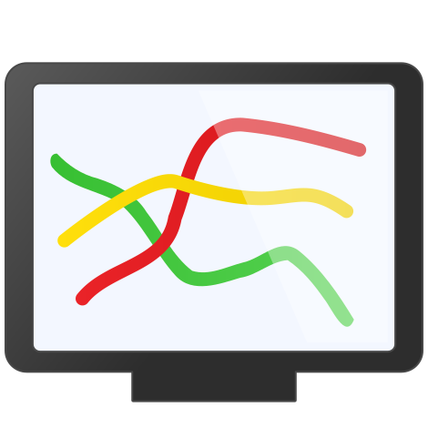

Dashkiosk's documentation
=========================

*Dashkiosk* is a solution to manage dashboards on multiple screens. It
comes in four parts:

 1. A **server** will manage the screens by sending them which URL
    they should display in realtime. A web interface enables the
    administrator to configure groups of dashboards as well as their
    associations with available displays.
   
 2. A **receiver** runs in a browser attached to each screen. On
    start, it contacts the server and waits for it to tell which URL
    to display.

 3. An **Android application** provides a simple fullscreen webview to
    display the receiver.

 4. A **Chromecast custom receiver** which will run the regular receiver
    if you want to display dashboards using Google Chromecast devices.

The Android application and the Chromecast receiver are optional
components. Any device able to display a fullscreen web page should
work.

A live installation, reset every hour, is publicly available:
 - `administration panel`_
 - `receiver`_

Here is a demonstration video:

.. raw:: html

    
<iframe src='http://www.youtube.com/embed/Vb4BvEzoYOU' frameborder='0' allowfullscreen></iframe>

To contribute, use `GitHub`_.

.. _GitHub: https://github.com/vincentbernat/dashkiosk/
.. _administration panel: http://dashkiosk.app.exo.io/admin
.. _receiver: http://dashkiosk.app.exo.io/receiver

.. toctree::
   :maxdepth: 2

   install
   configuration
   usage
   api
   android
   chromecast
   cloud
   license

Indices and tables
==================

* :ref:`genindex`
* :ref:`search`

