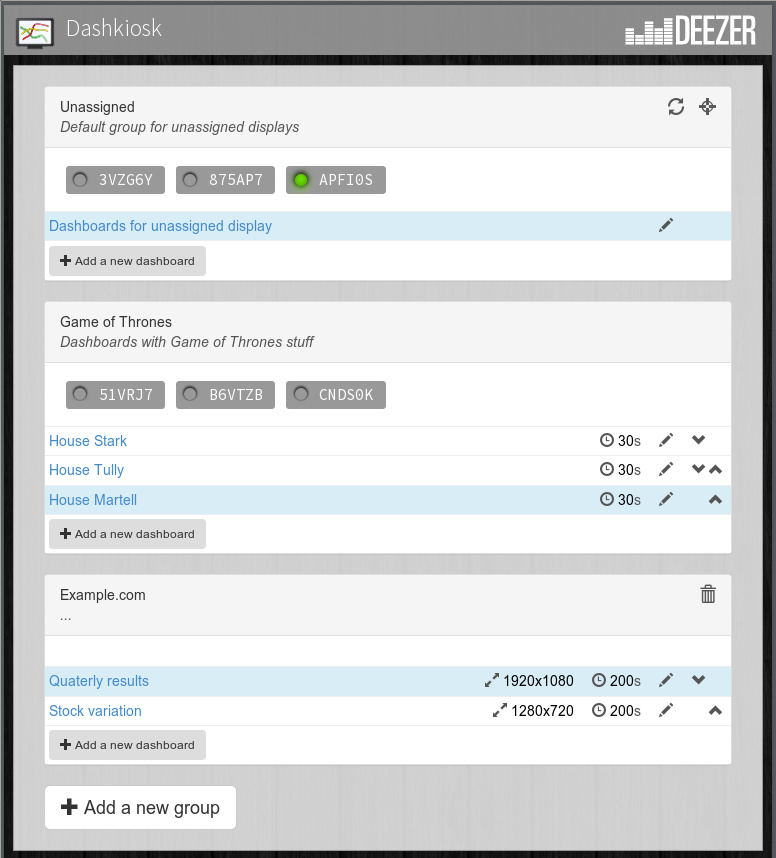
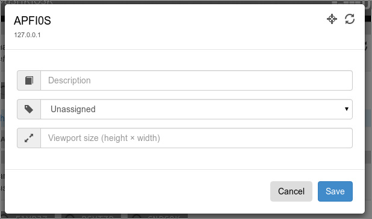
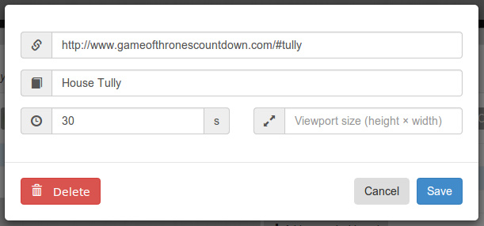

Usage
=====

Running the server
------------------

Once installed and configured, running *Dashkiosk* should be
straightforward. While in the ``build`` directory::

    $ node server.js --environment production

Don't forget to specify the environment! See :doc:`configuration` for
available options. They can also be specified in a configuration file.

Testing
+++++++

The server has three browser endpoints:

 - ``/unassigned`` which is the default dashboard for unassigned displays,
 - ``/admin`` which is the administration interface,
 - ``/receiver`` which is the receiver part that a display should load.

To test that everything is setup correctly, point your browser to
``/unassigned`` (for example ``http://localhost:9400/unassigned`` if
you kept the default parameters and installed *Dashkiosk* on your PC).

You should see the default dashboard displayed for unknown
device. These are just a few photos cycling around.

Then, you should go to the administration interface located in
``/admin``. While in the administration interface, open another tab
and go to ``/receiver`` which is the URL displaying the receiver. In
the ``/admin`` tab, you should see yourself as a new display in the
"Unassigned" group and in the ``/receiver`` tab, you should see the
default dashboard that you got by going in ``/unassigned``.

Troubleshooting
+++++++++++++++

If something goes wrong, be sure to look at the log. Either you run
the server through something like `supervisord`_ and you can have a
look at the log in some file or you can use ``--log.file`` to get a
log file.

.. _supervisord: http://supervisord.org/

Administration
--------------

The administration interface allows to create new dashboards, see
active displays and associate them to a group of dashboards. When
pointing a browser to the ``/admin`` URL, you should see an interface
like this:

   
   The administration interface with a few groups. At the top, the
   special "Unassigned" group.

On the figure above, you can see the three main entities in *Dashkiosk*:

 1. The monitors with a 5-digit serial numbers are the
    **displays**. For each of them, the serial number is attributed on
    their first connection and stored locally in the display
    [#storage]_. They come with a green light when they are actually
    alive.

 2. Each display is affected to a **group** of displays. In the above
    figure, we have three groups. It is possible to move a display
    from one group to another. Each group can have a name and a
    description. It is possible to create or rename any group. The
    group named "Unassigned" is special and new displays will be
    attached to it on first connection. Other than that, this is a
    regular group. The other special group is "Chromecast
    devices". See :ref:`chromecast`.

 3. Each group of displays contains an ordered list of
    **dashboards**. A dashboard is just an URL to be displayed with a
    bunch of parameters. You can reorder the dashboards in a group and
    choose how much time they should be displayed.

The first time, you will only have the special "Unassigned" group
[#f1]_.

Displays
++++++++

Clicking on a display will show a dialog box with various information
about the display.

   
   The dialog box of the ``APFI0S`` display.

First, you get the IP address of the display. This could be useful if
you need to connect to it for some other purpose (like debugging a
problem related to this display). If the display is offline, the IP
displayed is the last known IP.

Then, on the top right corner, there are contextual icons relevant to
the current display. On a display, you can execute two actions:

 - force a reload of the receiver (after an update, for example),
 - toggle the OSD on the receiver.

The receiver OSD is a neat feature to check if the display you are
inspecting is really the one you are interested in. It will display an
overlay with the display name as well as some technical information
that may be useful when displaying dashboards.

Not shown on the above figure, you can destroy a display by clicking
on the ``Delete`` button in the lower left corner.

You can assign a description to the display, like "*In the
kitchen*". You can also change the group the display is currently
attached to by choosing another group in the dropdown menu. The
display should immediatly display the current dashboard of the group.

The viewport will be explained in a dedicated section. See
:ref:`viewport`.

On a desktop browser, it is also possible to move the display to
another group by dragging it to the appropriate group.

Groups
++++++

By default, you only get the "Unassigned" group. But you can create
any number of groups you need by clicking on the "*Add a new group*"
button.

The name and the description of a group can be changed by clicking on
them. If you change the name of the "Unassigned" group, a new
"Unassigned" group will be created the next time a new display comes
to live.

As for displays, you can execute contextual actions on a group. There
are three of them:

 - for a reload of all the displays in the group,
 - toggle the OSD of all the displays in the group,
 - destroy the group.

The group can only be destroyed if no display is attached to it.

Each group has a list of dashboards. You can reorder them by using the
up and down arrow icons on the right of each dashboard. You can add a
new dashboard by using the "*Add a new dashboard*" button.

Dashboards
++++++++++

When creating a dashboard or modifying an existing one (by clicking on
the little pen icon), you will get the following dialog box:

   
   The dialog box to modify some random dashboard.

Currently, a dashboard has:

 - an URL
 - an optional description
 - a timer to tell how much time the dashboard should be displayed
 - a viewport size (see :ref:`viewport`).

The timer is optional but it doesn't make sense to omit it if you have
several dashboards in a group. Without it, once the dashboard is
displayed, the next one will never be displayed unless you remove or
modify the current one.

You can also modify the timer and the viewport by clicking on them
directly in the list of dashboards in each group.

About the dashboards
--------------------

The dashboards to be displayed can be any URL accessible by the
displays. When a new dashboard has to be displayed for a group, the
server will broadcast the URL of the dashboard to each member of the
group. They will load the dashboard and display it. This may seem easy
but there are several limitations to the system.

Network access
++++++++++++++

So, the first important thing about those dashboards is that they are
fetched by the displays, not by the server. You must therefore ensure
that the dashboards are accessible by the displays and not protected
by a password or something like that.

Processing power
++++++++++++++++

Some dashboards may be pretty dynamic and use special effects that
look cool on the average PC. However, when using a US$ 30 low-end
Android stick to display it, it may become a bit laggy. Also, please
note that the Android application uses a modern webview but some
functionalities may be missing, like WebGL.

.. _viewport:

Viewport
++++++++

By default, a dashboard is displayed using the native resolution of
the display. If the display is a 720p screen and your dashboard can
only be rendered correctly on a 1080p screen, you have a
problem. There are several solutions to this problem.

 1. Use a responsive dashboard that can adapt itself to any resolution.

 2. Change the viewport of the display. By clicking on the display,
    you can specify a viewport. When empty, it means that you use the
    viewport matching the native resolution of the screen. By
    specifying another resolution, the display will render the
    dashboards at the given resolution and zoom in or out to fit it
    into its native resolution.

    The support of this option depends on the ability of the browser
    running the receiver to exploit this information. Android devices
    are able to make use of it but other devices may not. If you don't
    see any effect when changing the viewport, use the next option.

 3. Change the viewport of the dashboard. This is quite similar to the
    previous option but it is a per-dashboard option and it will work
    on any device. It works in the same way: the rendering will be
    done at the given resolution and then resized to fit in the
    screen. Both options can be used at the same time, there is no
    conflict.

IFrames
+++++++

Technically, the receiver is a simple app rendering the requested URL
inside an IFrame which is like a browser inside a browser. There are
some limitations to an IFrame:

 - The receiver has almost no way to communicate with the IFrame
   [#iframe]_. It can know when an IFrame is ready but not if there is
   an error. The IFrame can therefore be displayed while it is not
   fully rendered and on the other hand, we cannot detect any error
   and try to reload the IFrame.

 - The IFrame can refuse to be display its content if there is a
   special ``X-Frame-Options`` in the headers forbidding the use of an
   IFrame.

The second limitation can be quite annoying. Here are some workarounds:

 1. Find an embeddable version of the content. Youtube, Google Maps
    and many other sites propose a version specifically designed to be
    embedded into an iframe.

 2. Use a web proxy that will strip out the offending header. A good
    base for such a proxy is `Node Unblocker`_. It should be easy to
    modify it to remove the ``X-Frame-Options`` header.

 3. Use a screenshot service. Instead of displaying the real website,
    just display a screenshot. There are many solutions to implement
    such a service with headless browsers like Phantom.JS. For example
    `this one`_.

.. _Node Unblocker: http://nodeunblocker.com/proxy
.. _this one: https://github.com/fzaninotto/screenshot-as-a-service

.. _chromecast:

Chromecast devices
------------------

*Dashkiosk* can optionnaly handle Chromecast devices. When the support
is enabled (see :ref:`options`), _Dashkiosk_ will discover Chromecast
devices on the network assign them to the special group "Chromecast
devices". This group has no dashboard on purpose.

If a Chromecast device is on a group with a dashboard, _Dashkiosk_
will wait for the Chromecast device to be on the home screen and
starts a custom receiver which will load the regular receiver and turn
your Chromecast device into a regular display.

You can either add dashboards to the "Chromecast devices" group to let
all Chromecast devices display a dashboard on inactivity or move the
selected Chromecast devices to another group.

.. rubric:: Footnotes

.. [#iframe] If the iframe is in the same domain, it can communicate
             with the iframe. However, most of the time, this is not
             the case. The receiver can also communicate with a
             cooperating iframe by sending messages. This is currently
             not implemented.
.. [#storage] The serial number is stored either in the local storage
              of the browser or in a cookie. If a display comes
              without this serial number or with an invalid one, it
              will be granted a new one.
.. [#f1] If you don't have this group, this may be because no display
         has ever been registered. In this case, point your browser to
         the ``/receiver`` URL to register one.
